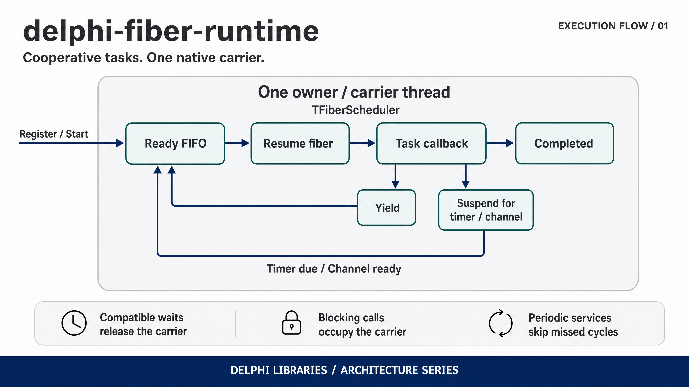

# Delphi Fiber Runtime

[](https://github.com/ramonruanxc/delphi-fiber-runtime/actions/workflows/ci.yml)
[](LICENSE)

Periodic services, cooperative waits and managed events in Object Pascal.
Each service reuses a task with its own stack; many tasks share one native thread.
A service waiting for a timer or channel releases that thread to another task.

The runtime is experimental. The integrated fiber API is validated only with
**Free Pascal 3.2.2** on the targets listed below. Delphi XE7 or later on
Windows compiles it without configuration, but no Delphi build has been
executed yet. The standalone periodic core is separate.

## Quick start

```sh
git clone https://github.com/ramonruanxc/delphi-fiber-runtime.git
```

- **Delphi XE7 or later (Windows):** open `demo/QuickStart.dpr` and press F9.
  Unit paths are in the program file; no search paths or defines are needed.
- **FPC 3.2.2 on Windows:** `cd demo`, `fpc QuickStart.dpr`, then `QuickStart.exe`.
- **FPC on Linux or macOS:** `python scripts/build_example.py`, which also builds
  the static context helper.

The run takes about a third of a second and ends with:

```text
Last message: Hello from tick 5
period_us=50000 started=5 skipped=0
published=5 received=5 discarded=0 aborted=0
PASS: QuickStart services and managed events stopped cleanly
```

`ContextDemo`, `PeriodicDemo` and `RuntimeDemo` open and run the same way.
`ReferenceDemo` needs pinned sibling sources and is used only by automation.

```pascal
Scheduler := TFiberScheduler.Create(2);           { producer + subscriber task }
Hub := TFiberEventHub.Create(Scheduler, 16, 1);   { deliveries, subscriptions }
Producer := TFiberService.Create(Scheduler, 50000, PublishTick, nil);
Receiver := TFiberService.Create(Scheduler, 50000, DormantTick, nil);
Publisher := Hub.Attach(Producer);
Subscription := Hub.Subscribe(Hub.Attach(Receiver), ReceiveMessage, nil);

Producer.Start;                                  { period: 50,000 microseconds }
Scheduler.RunUntil(Scheduler.NowUs + 275000);     { pump on the creating thread }
StopAll;                                        { check every Stop result }
```

This is the wiring from [QuickStart.dpr](demo/QuickStart.dpr). Its complete
program includes the payload, callbacks, fault checks and cleanup. The receiver
is a dormant service that owns a subscription: it does not need `Start` to
receive events. `StopAll` is an application procedure, shown below.

## Execution flow



Many stackful tasks share one owner thread. The scheduler resumes ready tasks;
cooperative yields, timers and channel waits let other tasks run. Blocking
calls still occupy the carrier.

## Why this exists

A native thread for every long-lived service is easy to reason about, but each
thread carries its own scheduling and stack cost. A worker pool shares threads,
but a job that blocks keeps its worker occupied. This runtime explores a third
execution model: a service keeps a stack across nested calls and explicitly
suspends while another service uses the same carrier thread.

The caller owns and pumps that carrier. There is no automatically created worker
pool, task migration, transparent blocking-I/O interception or GUI dispatch lane.
This is useful for periodic workflows built around compatible waits. Arbitrary
blocking library calls still block every task on the carrier.

| Project / model | Unit of work | Where work executes | Waiting and lifetime |
|---|---|---|---|
| [delphi-concurrent-pool](https://github.com/ramonruanxc/delphi-concurrent-pool) | Submitted jobs | Fixed set of native worker threads | Blocking work occupies a worker; shutdown drains or drops queued jobs |
| [delphi-service-host](https://github.com/ramonruanxc/delphi-service-host) | Long-lived services | One native thread per service; event delivery has explicit lanes | Service cancellation, thread joining and pending-event disposal |
| This runtime | Persistent stackful tasks and periodic services | One owner thread per scheduler | Compatible waits suspend tasks; stop pumps cooperative cleanup |
| Java virtual threads, the inspiration | Virtual threads managed by the JVM | JVM-managed carriers | The JVM supplies its own scheduling and blocking integration; this Pascal runtime implements neither JVM semantics nor API compatibility |

The sibling libraries are design and benchmark references. They are not runtime
or Boss dependencies. Measurements do not establish universal superiority over
those execution models.

## Install

Install from your consumer project with [Boss](https://github.com/HashLoad/boss).
For a new project without `boss.json`, initialize it with `boss init` first:

```sh
boss install github.com/ramonruanxc/delphi-fiber-runtime
```

Boss 3.0.17 installs it under
`modules/github_com_ramonruanxc_delphi-fiber-runtime/`. Add that directory's
`src/` to the FPC unit search path and keep its backend subdirectories.

Boss 3.0.17 may follow `main` even when `boss.json` specifies a version
constraint. When the exact revision matters, use the tagged Git clone below or
a source archive from that release.

Boss retrieves source; it does not expand the compiler support matrix or compile
the Unix native helper. The [getting-started guide](docs/getting-started.md)
shows the complete consumer build, including the helper.

By hand, select the documented release explicitly:

```sh
git clone --branch v0.3.3-prototype.1 --single-branch https://github.com/ramonruanxc/delphi-fiber-runtime.git
```

Add that clone's `src/` to your unit search path. Windows uses native fibers and
needs no extra native archive. Linux and macOS also need the shipped static
context helper; retain `native/context/` and its included license when copying
source. No separately installed Boost or C++ runtime is required.

## Writing a periodic service

Services use a plain procedure and borrowed `Data: Pointer`, rather than a
subclass. The callback receives its persistent task and the scheduled tick:

```pascal
procedure PublishTick(Task: TScheduledTask; const Tick: TPeriodicTick;
  Data: Pointer);
var
  Message: IMessage;
begin
  Message := TMessage.Create('Hello from tick ' + IntToStr(Tick.Index));
  if not Publisher.Publish(Message) then
    raise Exception.Create('Event capacity exhausted');
  Task.Delay(5000);  { Other tasks can run during this 5 ms wait. }
end;
```

`IMessage` and `TMessage` are the small immutable interface payload defined in
QuickStart. `Publisher` is the endpoint attached to this service. A real callback
can obtain its own state through `Data`; that state must outlive all callbacks
and any unsuccessful stop attempt.

`TFiberService.Create(Scheduler, PeriodUs, Callback, Data)` creates a dormant
service. `Start` fixes its epoch and creates one persistent task. Start it once:
services cannot restart. The first activation is at `epoch + period`.

Deadlines follow `epoch + n * period`, measured by a monotonic clock. Callback
execution time does not accumulate as schedule drift. A suspended callback is
still active, so a service never overlaps with itself. When it finishes, elapsed
cycles are skipped and counted; when dispatch is late, older due cycles are
skipped and only the latest eligible cycle runs.

For example, a 1 ms service starting at 1.04 ms and finishing at 3.20 ms skips the
2 ms and 3 ms cycles. Its next deadline is 4 ms. Inspect `StartedCount` and
`SkippedCount`; choosing a 1,000 us period does not guarantee 1 ms delivery latency.

## Subscribing and carrying data

```pascal
procedure ReceiveMessage(Task: TScheduledTask; Source: TServiceEndpoint;
  const Payload: IInterface; Data: Pointer);
begin
  LastMessage := (Payload as IMessage).Text;
  Inc(Received);
end;
```

`Hub.Subscribe(RecipientEndpoint, ReceiveMessage, Data)` creates a persistent
dispatcher task. Each subscription receives publications from the hub's open
sources; this API has no built-in topic or source filters. `Source` identifies
the publisher if your handler needs to select events. Handlers run on the owner
carrier and may use the same compatible waits as service callbacks.

`Endpoint.Publish(Payload)` is owner-only and never waits for capacity. It admits
the entire fanout to current subscriptions or returns `False`. Each accepted
pending delivery retains an interface reference. The publisher can release its
reference immediately; the final reference releases the payload. Keep shared
payloads immutable, or synchronize changes explicitly.

Hub capacity bounds pending deliveries, with active handlers tracked separately.
For two subscribers, one publication needs two pending slots. Subscription tasks
also consume scheduler capacity. `TFiberScheduler.Create(MaxTasks)` limits total
`Spawn` calls over its lifetime: completed tasks do not return admission slots.

For native producer threads, `Endpoint.Post(Payload)` accepts a bounded envelope
for later owner-side publication. A `True` return is envelope acceptance, not a
promise that deferred fanout will fit. Check `PostRejectedCount` as well as
`PostAcceptedCount`. Retain the hub while producers can post; cross-thread payload
reference counting must be thread-safe. Reference-management code must not raise,
suspend or reenter the runtime.

## Waiting and stopping

`Task.Yield` gives another task a turn. `Task.Delay(DurationUs)` and
`Task.AwaitUntil(DeadlineUs)` suspend until eligible or cancelled.
`TFiberChannel.Send` / `Receive` suspend on full / empty channels; `TrySend` does
not suspend. Raw channel values are borrowed pointers, unlike managed hub events.
`Close` wakes waiters and allows buffered values to drain.

These operations run on the scheduler's creating thread. `Scheduler.Post` and
`Scheduler.RequestStop` are explicit cross-thread entry points; most other APIs
are owner-only. Scheduler posts borrow their data and cannot suspend. The idle
carrier parks using the native timer and wakeup backend rather than polling.

Shutdown is part of the communication contract. Stopping an attached source
blocks its publication, discards its pending deliveries and waits for active
handlers attributed to it. Stopping a recipient cancels its subscriptions and
settles their handlers. Successful service `Stop` means no subsequent invocation
or attributed event callback. It does not mean every queued event was delivered.

```pascal
Producer.Cancel;
Receiver.Cancel;
if not Producer.Stop(1000000) then
  raise Exception.Create('Producer stop timed out; resources retained');
if not Receiver.Stop(1000000) then
  raise Exception.Create('Receiver stop timed out; resources retained');
if not Scheduler.Stop(1000000) then
  raise Exception.Create('Scheduler stop timed out; resources retained');

Producer.Free;
Receiver.Free;
Hub.Free;
Scheduler.Free;
```

Run that sequence on the owner, outside callbacks. **If any stop times out,
retain the objects, stacks and borrowed data and retry cleanup later.** Do not
put unconditional `Free` calls after a failed stop in a `finally` block.
QuickStart implements this sequence with partial-construction handling. Its
failure path exits nonzero without destroying live resources.

Timeouts are cooperative budgets: a callback that blocks or never yields cannot
be forcibly interrupted. Cancellation wakes compatible waits and lets Pascal
`finally` blocks unwind. Do not suspend inside exception handlers, during stack
unwinding or while holding native locks. `threadvar` remains shared by tasks on
the carrier; use explicit task state (`LocalValue`) for task-local data.

Escaping callback faults stop the task and remain available through `Task.State`,
`Task.ErrorClass` and `Task.ErrorMessage`. A clean stop alone does not establish
successful work; inspect both service and subscription task faults. Never free
scheduler-owned tasks or hub-owned endpoint/subscription handles yourself.

## Units and boundaries

| Unit | Responsibility |
|---|---|
| `FiberRuntime.Schedule` | Standalone fixed-rate deadline arithmetic, skipping and segments |
| `FiberRuntime.Platform` | Monotonic clocks, native timers, notifications and resume detection |
| `FiberRuntime.Context` | Stackful context switching and compiler-specific RTL adapters |
| `FiberRuntime.Scheduler` | Bounded FIFO dispatch, tasks, compatible timers, mailbox and cancellation |
| `FiberRuntime.Channel` | Bounded FIFO channels of borrowed pointers |
| `FiberRuntime.Service` | Persistent periodic task and service stop lifecycle |
| `FiberRuntime.ServiceHooks` | Lifecycle boundary used to attach service communication |
| `FiberRuntime.EventHub` | Managed event payloads, bounded fanout and source/recipient cleanup |

`Schedule` and `Platform` can be used without importing `Context`. The integrated
path layers services and channels over the scheduler and context backend. The
[periodic](docs/periodic-contract.md), [context](docs/context-contract.md) and
[runtime](docs/runtime-contract.md) contracts specify the detailed invariants.

## Running examples and tests

Install FPC 3.2.2 and Python 3.12. Linux needs the FCL units and a C toolchain;
macOS needs the Apple command-line tools. Run from the repository root:

```sh
python scripts/check.py
python scripts/package.py
```

The check runner builds and runs the functional suites, named negative builds
and demos. Packaging uses tracked Git files, then compiles and runs an extracted
consumer in a path with spaces. Output goes to `build/check/` and `dist/`.
Use `python scripts/check.py --references` to also fetch and compare the pinned
sibling revisions. `--core-only` exercises the standalone core without contexts.

For just the small example, see the [QuickStart build commands](docs/getting-started.md#build-quickstart).
From a clone, `python scripts/build_example.py` builds and runs it, preparing the
Unix native helper where required.
The other demos answer different questions:

| Demo | Purpose |
|---|---|
| `QuickStart` | One periodic publisher, an interface payload, a subscriber and checked cleanup |
| `PeriodicDemo --cycles 10000 --period-us 1000 --work-us 100` | Standalone timing CSV with planned deadlines and skips |
| `ContextDemo` | Stackful tasks, repeated suspension and cancellation |
| `RuntimeDemo --services 8 --cycles 200 --await-us 2500` | Integrated service/event measurements with suspended callbacks |

Timing reports are descriptive. A 1 ms planned period is not a hard real-time
guarantee. `scripts/report.py` can assess explicit lateness thresholds, counting
skips as violations; qualification also needs an agreed workload, hardware,
duration and power configuration. See [verification](docs/verification.md).

## Compiler and platform status

The [support matrix](docs/support-matrix.md) links the revision-specific evidence.
Functional validation is separate from timing or physical suspend qualification.

| Tier | Combinations / limitation |
|---|---|
| Integrated runtime functionally exercised | FPC 3.2.2: Windows x86/x64, Linux x64 (hosted native and local WSL2), macOS Intel x64 and ARM64 hosted runners |
| Standalone periodic core | Tested on those FPC targets; it has no context dependency |
| Delphi | Unvalidated. The installed Delphi 12 edition refused CLI compilation; XE7+ Windows builds use an unexecuted adapter; older Delphi versions are rejected |
| Other FPC versions / CPUs | Require their own RTL adapters and execution evidence; context guards reject unsupported combinations |
| Outside this milestone | Mobile, transparent blocking I/O, task migration, hard real-time guarantees and qualified physical suspend/resume cycles |

Windows uses native fibers with floating-point state preservation. Unix links
the bundled Boost.Context 1.85.0 assembly through a small C helper; `cthreads`
must appear first in the program's `uses` clause. Custom thread managers and
nondefault exception/sanitizer configurations are unqualified. Demo programs
list every unit with an explicit `in` path, so they build from a fresh clone
without search paths; that does not qualify an unexecuted compiler.

Valid detected resumes rebase periodic segments after active invocations finish;
invalid clocks stop admission and request cooperative cleanup. Older Windows
versions may report suspend detection unavailable. Consult the contracts before
building a policy around suspend behavior.

[Getting started](docs/getting-started.md) · [Evidence](docs/evidence/README.md) ·
[Release notes](docs/release-notes.md) · [MIT license](LICENSE)
